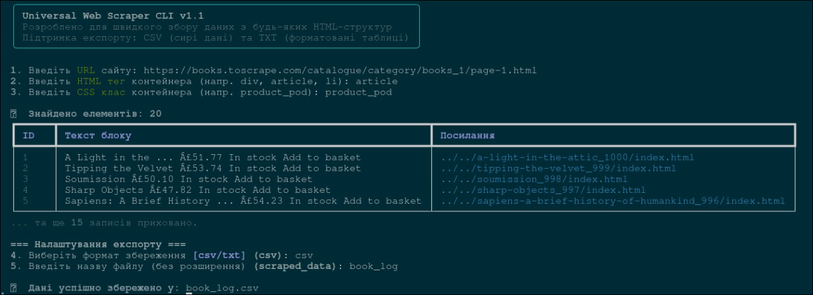

# Universal Web Scraper CLI
A modular, interactive command-line tool written in Python for extracting data from generic HTML structures. Designed to avoid hardcoding selectors by taking target URLs and CSS classes directly via the CLI.



## Features
* **Interactive CLI**: Built with `rich` for a clean, colorful terminal experience with progress indicators.
* **Dynamic Selectors**: Target any HTML tag and class combination on the fly.
* **Data Export**: Automatically structures scraped data and exports it to a clean `.csv` format using `pandas`.
* **Modular Architecture**: Core scraping logic is strictly separated from the CLI and export modules.

## Tech Stack
* Python 3.10+
* `requests`, `beautifulsoup4`, `pandas`, `rich`

## Usage
1. Clone the repository.
2. Install dependencies: `pip install -r requirements.txt` (or install manually).
3. Run the tool: `python main.py`
4. Follow the interactive prompts to input the target URL, HTML tag, and CSS class.


## System Architecture

```mermaid
sequenceDiagram
    actor User as Користувач
    participant CLI as main.py (CLI)
    participant Scraper as scraper.py (Core)
    participant Site as Веб-сайт
    participant Exporter as exporter.py
    participant FS as Файлова система

    User->>CLI: Запуск утиліти & Ввід (URL, тег, клас)
    activate CLI
    
    CLI->>Scraper: fetch_html(URL)
    activate Scraper
    Scraper->>Site: HTTP GET запит (requests)
    Site-->>Scraper: HTML сторінка
    Scraper-->>CLI: Сирий HTML
    deactivate Scraper

    CLI->>Scraper: extract_data(HTML, тег, клас)
    activate Scraper
    Note right of Scraper: Парсинг DOM-дерева<br/>(BeautifulSoup4)
    Scraper-->>CLI: Структуровані дані (List of Dicts)
    deactivate Scraper

    CLI-->>User: Рендер прев'ю (rich таблиця)
    User->>CLI: Вибір формату (CSV / TXT) та назви

    alt Формат CSV
        CLI->>Exporter: to_csv(data, filename)
        activate Exporter
        Exporter->>FS: Запис .csv (pandas)
        Exporter-->>CLI: Шлях до файлу
        deactivate Exporter
    else Формат TXT
        CLI->>Exporter: to_pretty_report(data, filename)
        activate Exporter
        Exporter->>FS: Запис .txt (tabulate ASCII)
        Exporter-->>CLI: Шлях до файлу
        deactivate Exporter
    end

    CLI-->>User: Повідомлення про успішний експорт
    deactivate CLI